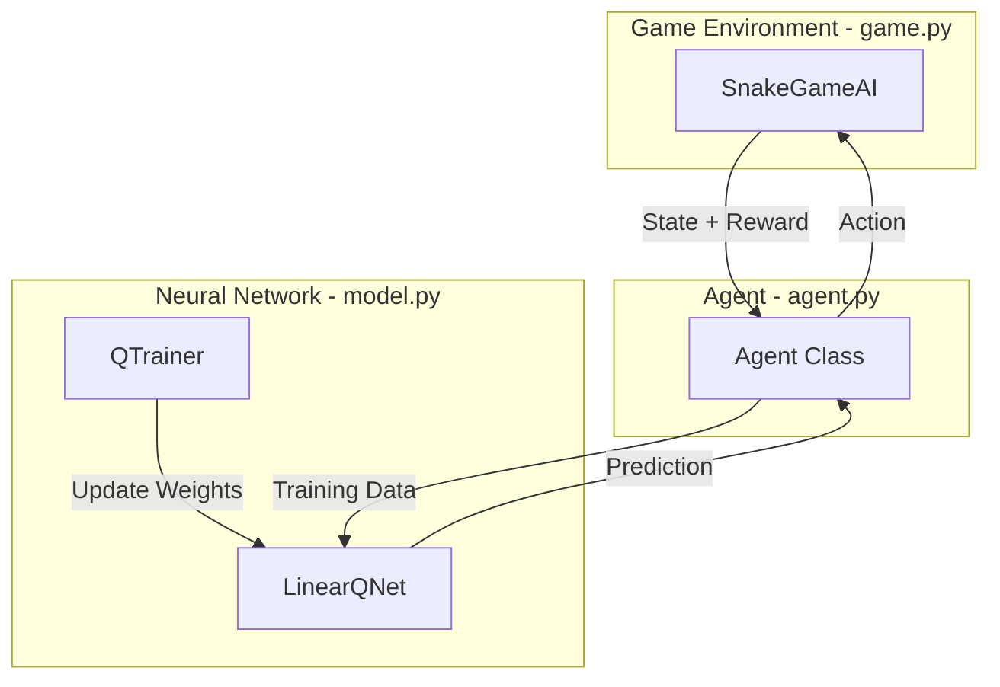
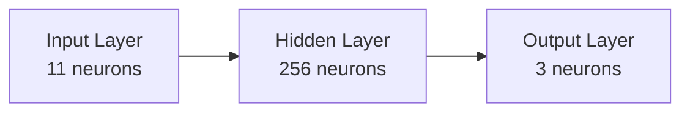

# 🎓 Семинар: Создаем Искусственный Интеллект для Змейки

Добро пожаловать! Сегодня мы разберем, как научить компьютер играть в "Змейку" с нуля. Мы не просто написали скрипт, мы создали систему **Deep Reinforcement Learning (Глубокого Обучения с Подкреплением)**.

Представьте, что вы дрессируете щенка. Вы не говорите ему "подними лапу на 10 см и согни сустав". Вы говорите "Лапу!" и даете вкусняшку, если он сделал правильно. Если он кусает диван — вы его ругаете.
*   **Агент** — это наш щенок (Змейка).
*   **Среда** — это комната (Игровое поле).
*   **Награда** — вкусняшка (+10) или наказание (-10).

---

## 🗺️ Карта Архитектуры

Наша программа состоит из трех главных файлов. Давайте посмотрим, как они связаны:



---

## 1. 🎮 Среда (`game.py`)

Это "физический мир" нашей игры. Нейросеть не видит экран, как мы. Ей нужны цифры.

### Главная функция: `play_step(action)`
В обычной игре мы ждем нажатия клавиш. Здесь мы ждем команду от Агента.

```python
def play_step(self, action):
    # 1. Двигаемся
    self._move(action) 
    
    # 2. Проверяем, живы ли мы
    if self.is_collision():
        return -10, True, score  # Наказание! Игра окончена.
        
    # 3. Проверяем, поели ли мы
    if self.head == self.food:
        return 10, False, score  # Вкусняшка!
        
    # 4. Просто идем дальше
    return 0, False, score       # Ничего особенного.
```

**Почему это важно?**
Это **Функция Награды (Reward Function)**. Это единственный способ объяснить Агенту, что хорошо, а что плохо. Если мы уберем наказание за смерть, змейка будет просто крутиться на месте.

---

## 2. 🧠 Мозг (`model.py`)

Здесь живет Нейросеть. Мы используем **DQN (Deep Q-Network)**.

### Что такое Q-Value?
`Q` означает **Quality** (Качество).
Для любой ситуации (State) сеть пытается предсказать **Качество** каждого из 3 возможных действий:
1.  Идти прямо
2.  Повернуть направо
3.  Повернуть налево

Пример:
*   Ситуация: Впереди стена, слева еда.
*   Предсказание сети: `[Straight: -10, Right: 0, Left: 10]`
*   Агент выбирает **Left**, потому что 10 — самое большое число.

### Архитектура Сети (`LinearQNet`)
Это простая сеть "Feed Forward" (прямого распространения).



*   **Вход (11)**: Глаза змейки (где еда? где стены?).
*   **Скрытый слой (256)**: Здесь происходит "мышление". Нейроны находят закономерности.
*   **Выход (3)**: Оценка действий `[Прямо, Вправо, Влево]`.

### Математика Обучения (`QTrainer`)
Как сеть учится? Мы используем **Уравнение Беллмана**:

$$ Q_{new} = Reward + \gamma \cdot \max(Q_{next}) $$

По-русски:
> "Ценность текущего шага = Мгновенная награда + (Скидка * Лучшее, что может случиться дальше)"

Если змейка сделала шаг и увидела еду, этот шаг становится ценным, потому что он ведет к награде в будущем.

---

## 3. 🕵️ Агент (`agent.py`)

Это "дирижер", который соединяет Игру и Мозг.

### Зрение Агента (`get_state`)
Агент не видит картинку. Он видит вектор из 11 чисел (0 или 1):

1.  **Опасность (3)**: Есть ли стена Прямо? Справа? Слева?
2.  **Направление (4)**: Куда мы сейчас ползем? (Вверх, Вниз, Влево, Вправо)
3.  **Еда (4)**: Где еда относительно головы? (Еда слева? Еда справа? и т.д.)

Пример вектора: `[1, 0, 0, 0, 1, 0, 0, 0, 0, 1, 0]`
*   `1` (Опасность прямо)
*   `0, 1, 0, 0` (Движемся вправо)
*   `0, 0, 1, 0` (Еда сверху)
*   **Вывод:** "Я ползу вправо, впереди стена, еда сверху. Надо повернуть налево!"

### Память (`deque`)
Агент запоминает все свои шаги в `memory`.
Зачем? Чтобы учиться не только на том, что случилось секунду назад, но и переосмысливать прошлый опыт.
Это называется **Experience Replay (Повторное переживание опыта)**.
После каждой смерти Агент берет 1000 случайных моментов из прошлого и тренирует на них мозг заново. Это делает обучение стабильным.

### Exploration vs Exploitation (Исследование или Использование)
В начале обучения змейка тупая. Если она будет слушать свой необученный мозг, она будет делать глупости.
Поэтому мы вводим параметр `epsilon` (случайность).
*   В начале `epsilon` высокий: Змейка ходит случайно (исследует мир).
*   Со временем `epsilon` падает: Змейка начинает доверять своему опыту (использует знания).

```python
# agent.py
if random.randint(0, 200) < self.epsilon:
    move = random_move() # Рискуем и пробуем новое!
else:
    move = model_prediction() # Делаем как учили.
```

---

## Итог: Как это работает вместе?

1.  **Наблюдение**: Агент смотрит на мир (`get_state`).
2.  **Решение**: Агент выбирает действие (`get_action`).
3.  **Действие**: Игра двигает змейку (`play_step`).
4.  **Результат**: Игра говорит "Ты жив" или "Ты умер" (`reward`).
5.  **Обучение**:
    *   **Short Memory**: Агент сразу корректирует веса сети (немного).
    *   **Long Memory**: Если игра кончилась, Агент садится и "обдумывает" 1000 прошлых шагов.

Вот так, шаг за шагом, через тысячи ошибок, наша Змейка становится гроссмейстером! 🐍🏆
